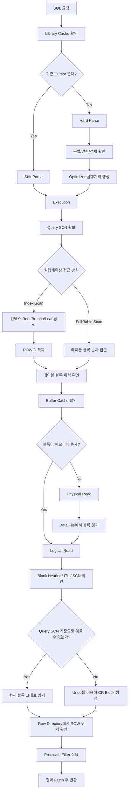

# DB에서 한 ROW를 읽을 때 일어나는 전체 흐름

## 1. 개요

DB에서 `SELECT`로 한 ROW를 읽는 과정은 단순히 “디스크에서 한 줄 가져오기”가 아니다.

사용자는 아래와 같은 SQL을 실행한다고 생각한다.

```sql
SELECT *
FROM EMP
WHERE EMPNO = 7788;
```

겉으로 보기에는 `EMPNO = 7788`인 ROW 하나를 읽는 간단한 작업처럼 보인다.

하지만 Oracle 내부에서는 다음과 같은 수많은 메커니즘이 함께 동작한다.

- SQL 파싱
- Library Cache 확인
- Optimizer 실행계획 선택
- 인덱스 탐색
- ROWID 획득
- Buffer Cache 탐색
- Logical I/O
- Physical I/O
- Block Header 확인
- ITL 확인
- SCN 비교
- Consistent Read 판단
- Undo를 이용한 과거 버전 복원
- Delayed Block Cleanout
- Row Directory 접근
- Predicate Filter 적용
- Fetch를 통한 결과 반환

즉, DB에서 ROW 하나를 읽는다는 것은 실제로는 다음과 같은 흐름이다.

```text
SQL 수신
  ↓
파싱
  ↓
실행계획 선택
  ↓
인덱스 또는 테이블 블록 접근
  ↓
버퍼캐시 확인
  ↓
필요 시 디스크 I/O
  ↓
블록의 트랜잭션 상태 확인
  ↓
SCN 기준으로 읽을 수 있는 버전인지 확인
  ↓
필요 시 Undo로 과거 버전 복원
  ↓
ROW 추출
  ↓
조건 검증
  ↓
사용자에게 반환
```

---

## 2. 전체 흐름 요약

```text
1. SQL이 서버 프로세스로 전달된다.
2. Shared Pool의 Library Cache에서 동일 SQL Cursor가 있는지 확인한다.
3. Cursor가 없으면 Hard Parse를 수행한다.
4. Optimizer가 통계정보를 기반으로 실행계획을 선택한다.
5. SELECT 실행 시 Query SCN을 확보한다.
6. 실행계획에 따라 인덱스 또는 테이블을 접근한다.
7. 인덱스를 사용하는 경우 Root → Branch → Leaf Block을 탐색한다.
8. Leaf Block에서 ROWID를 얻는다.
9. ROWID를 이용해 테이블 블록 위치를 찾는다.
10. 해당 블록이 Buffer Cache에 있는지 확인한다.
11. Buffer Cache에 있으면 Logical Read가 발생한다.
12. Buffer Cache에 없으면 Data File에서 읽어 Physical Read가 발생한다.
13. 블록의 ITL과 SCN 정보를 확인한다.
14. 현재 블록이 Query SCN 기준으로 읽어도 되는 버전인지 판단한다.
15. 최신 변경사항이 있어 그대로 읽을 수 없으면 Undo를 이용해 과거 버전을 만든다.
16. 필요하면 Delayed Block Cleanout을 수행한다.
17. Row Directory를 통해 블록 안의 실제 ROW 위치를 찾는다.
18. Predicate 조건을 최종 검증한다.
19. SELECT절에 필요한 컬럼을 추출한다.
20. Fetch를 통해 클라이언트에게 결과를 반환한다.
```

---

## 3. 전체 구조 그림



---

# 4. 단계별 상세 설명

---

## 4.1 SQL 수신

사용자가 SQL을 실행하면 SQL 문장은 Oracle 서버 프로세스로 전달된다.

예시 SQL은 다음과 같다.

```sql
SELECT *
FROM EMP
WHERE EMPNO = 7788;
```

사용자 입장에서는 단순 조회지만, DB 입장에서는 먼저 다음을 판단해야 한다.

```text
이 SQL은 전에 실행된 적 있는가?
문법은 올바른가?
사용자에게 권한이 있는가?
EMP 테이블은 존재하는가?
EMPNO 컬럼은 존재하는가?
어떤 인덱스를 사용할 것인가?
테이블 전체를 읽는 것이 더 빠른가?
현재 읽으려는 데이터가 일관성 있는 버전인가?
```

---

## 4.2 Library Cache 확인

Oracle은 SQL을 실행하기 전에 Shared Pool 안의 Library Cache를 확인한다.

Library Cache에는 이미 파싱된 SQL Cursor가 저장되어 있을 수 있다.

```text
SQL 수신
  ↓
Library Cache 확인
  ↓
동일 SQL Cursor 존재 여부 확인
```

동일한 SQL이 이미 존재한다면 기존 Cursor를 재사용할 수 있다.

이 경우를 보통 `Soft Parse`라고 한다.

반대로 기존 Cursor가 없다면 SQL을 새로 분석해야 한다.

이 경우를 `Hard Parse`라고 한다.

관련 개념은 다음과 같다.

| 개념 | 설명 |
|---|---|
| Shared Pool | SQL, 실행계획, 데이터 딕셔너리 정보 등을 캐싱하는 메모리 영역 |
| Library Cache | SQL Cursor와 실행계획이 저장되는 영역 |
| Cursor | 파싱된 SQL과 실행계획을 담고 있는 객체 |
| Soft Parse | 기존 Cursor를 재사용하는 파싱 |
| Hard Parse | SQL을 새로 파싱하고 실행계획까지 새로 만드는 과정 |

---

## 4.3 Parse 단계

SQL이 처음 들어왔거나 재사용할 수 있는 Cursor가 없다면 Parse 단계가 수행된다.

Parse 단계에서는 다음을 확인한다.

```text
1. SQL 문법이 올바른가?
2. 테이블이 존재하는가?
3. 컬럼이 존재하는가?
4. 사용자가 해당 객체에 접근할 권한이 있는가?
5. SQL의 의미가 올바른가?
```

예를 들어 다음 SQL을 실행했다고 하자.

```sql
SELECT ENAME
FROM EMP
WHERE EMPNO = 7788;
```

Oracle은 다음을 확인한다.

```text
EMP 테이블이 존재하는가?
ENAME 컬럼이 존재하는가?
EMPNO 컬럼이 존재하는가?
현재 사용자가 EMP 테이블을 SELECT 할 권한이 있는가?
```

---

## 4.4 Optimizer가 실행계획을 선택한다

Parse가 끝나면 Optimizer가 실행계획을 선택한다.

Optimizer는 통계정보를 기반으로 가장 비용이 낮다고 판단되는 접근 방식을 선택한다.

예를 들어 아래 SQL이 있다고 하자.

```sql
SELECT *
FROM EMP
WHERE EMPNO = 7788;
```

`EMPNO`에 PK 인덱스가 있다면 Optimizer는 대체로 다음과 같은 실행계획을 선택할 수 있다.

```text
INDEX UNIQUE SCAN EMP_PK
  ↓
TABLE ACCESS BY INDEX ROWID EMP
```

이 뜻은 다음과 같다.

```text
1. EMP_PK 인덱스에서 EMPNO = 7788을 찾는다.
2. 인덱스 Leaf Block에서 ROWID를 얻는다.
3. ROWID를 이용해 EMP 테이블 블록에 접근한다.
4. 해당 ROW를 읽는다.
```

반대로 인덱스가 없거나, 조건에 맞는 데이터가 너무 많으면 Full Table Scan이 선택될 수 있다.

```text
TABLE ACCESS FULL EMP
```

즉, ROW 하나를 읽는 과정도 실행계획에 따라 완전히 달라진다.

---

## 4.5 Query SCN 확보

SELECT가 실행되면 Oracle은 해당 SELECT가 바라볼 기준 시점을 정한다.

이 기준 시점을 `Query SCN`이라고 이해하면 된다.

예를 들어 SELECT가 시작되는 순간의 SCN이 1000이라면, 이 SQL은 다음과 같은 의미를 가진다.

```text
이 SELECT는 SCN 1000 시점에 존재하던 데이터를 기준으로 조회한다.
```

Oracle의 일반 SELECT는 Statement-level Read Consistency를 보장한다.

즉, SELECT가 실행되는 도중 다른 세션이 데이터를 변경하고 COMMIT하더라도, 현재 SELECT는 자신이 시작한 시점의 데이터를 일관되게 읽는다.

예시:

```text
Session B의 SELECT 시작 시점: SCN 1000

Session A가 중간에 UPDATE 후 COMMIT: SCN 1010

Session B는 여전히 SCN 1000 기준의 데이터를 봐야 한다.
```

관련 개념은 다음과 같다.

| 개념 | 설명 |
|---|---|
| SCN | System Change Number. Oracle 내부의 논리적 시간 |
| Query SCN | SELECT가 바라보는 기준 시점 |
| Read Consistency | 일관성 읽기 |
| MVCC | 여러 버전의 데이터를 통해 읽기 일관성을 보장하는 구조 |
| Undo | 과거 버전의 데이터를 복원하기 위한 정보 |

---

# 5. 인덱스를 이용해 ROW를 찾는 과정

---

## 5.1 인덱스 탐색

인덱스를 사용하는 실행계획이라면 Oracle은 먼저 인덱스 블록을 탐색한다.

B*Tree 인덱스 구조는 대략 다음과 같다.

```text
Root Block
  ↓
Branch Block
  ↓
Leaf Block
```

예를 들어 `EMPNO = 7788`을 찾는다면 다음과 같은 과정이 발생한다.

```text
1. Root Block에서 어느 Branch로 가야 하는지 판단한다.
2. Branch Block에서 어느 Leaf Block으로 가야 하는지 판단한다.
3. Leaf Block에서 EMPNO = 7788인 인덱스 엔트리를 찾는다.
4. 해당 인덱스 엔트리에 저장된 ROWID를 얻는다.
```

---

## 5.2 인덱스 Leaf Block의 역할

인덱스 Leaf Block에는 보통 다음 정보가 들어 있다.

```text
인덱스 키 값 + ROWID
```

예를 들어 다음과 같다.

```text
EMPNO = 7788 → ROWID = AAASdfAAEAAAACXAAA
```

인덱스는 테이블 ROW 전체를 저장하는 것이 아니다.

일반적으로 인덱스는 조건 검색에 필요한 키 값과, 실제 테이블 ROW 위치를 가리키는 ROWID를 저장한다.

---

## 5.3 ROWID의 의미

ROWID는 Oracle에서 특정 ROW의 물리적 위치를 가리키는 주소에 가깝다.

ROWID에는 대략 다음 정보가 포함된다.

```text
Data Object 번호
Data File 번호
Block 번호
Row Slot 번호
```

즉, ROWID를 알면 Oracle은 다음을 알 수 있다.

```text
어느 데이터 파일에 있는가?
그 파일의 몇 번째 블록인가?
그 블록 안에서 몇 번째 ROW Slot인가?
```

따라서 인덱스 스캔 후 테이블 접근은 다음과 같이 이어진다.

```text
인덱스 Leaf Block에서 ROWID 획득
  ↓
ROWID를 이용해 테이블 블록 위치 확인
  ↓
해당 테이블 블록 접근
  ↓
블록 안에서 ROW Slot 확인
  ↓
실제 ROW 읽기
```

---

# 6. Buffer Cache 확인

---

## 6.1 블록 단위로 읽는다

DB는 ROW 단위로 디스크를 읽는 것이 아니라 기본적으로 `Block` 단위로 읽는다.

즉, ROW 하나가 필요해도 Oracle은 해당 ROW가 들어 있는 데이터 블록을 읽는다.

```text
사용자는 ROW 하나를 요청한다.
하지만 DB는 해당 ROW가 포함된 Block을 읽는다.
```

예를 들어 하나의 블록에 여러 ROW가 들어 있다면, Oracle은 그 블록 전체를 메모리에 올린 뒤 그 안에서 필요한 ROW를 찾는다.

---

## 6.2 Buffer Cache에서 블록 검색

Oracle은 필요한 블록을 바로 디스크에서 읽지 않는다.

먼저 Database Buffer Cache에 해당 블록이 있는지 확인한다.

```text
필요한 블록 주소 확인
  ↓
Buffer Cache 검색
  ↓
블록이 있으면 메모리에서 읽음
  ↓
블록이 없으면 디스크에서 읽음
```

이때 내부적으로는 대략 다음 구조를 사용한다.

```text
Data Block Address
  ↓
Hash Function
  ↓
Cache Buffer Chain
  ↓
Buffer Header 검색
  ↓
해당 블록 존재 여부 확인
```

관련 개념은 다음과 같다.

| 개념 | 설명 |
|---|---|
| Database Buffer Cache | 데이터 블록을 캐싱하는 메모리 영역 |
| Buffer Header | 버퍼에 올라온 블록의 메타정보 |
| Cache Buffer Chain | 버퍼를 찾기 위한 해시 체인 구조 |
| Logical I/O | Buffer Cache에서 블록을 읽는 것 |
| Physical I/O | 디스크에서 블록을 읽는 것 |

---

## 6.3 Logical Read

필요한 블록이 이미 Buffer Cache에 있다면 디스크 I/O 없이 메모리에서 읽는다.

이를 `Logical Read`라고 한다.

SQLP 실행통계에서는 `cr`, `cu` 같은 값과 연결된다.

```text
Buffer Cache에 블록 존재
  ↓
메모리에서 블록 읽음
  ↓
Logical Read 발생
```

Logical Read는 디스크를 읽지 않기 때문에 Physical Read보다 훨씬 빠르다.

하지만 Logical Read도 CPU와 메모리 자원을 사용하므로 무한히 공짜는 아니다.

---

## 6.4 Physical Read

필요한 블록이 Buffer Cache에 없다면 디스크에서 읽어야 한다.

```text
Buffer Cache miss
  ↓
Free Buffer 확보
  ↓
Data File에서 블록 읽기
  ↓
Buffer Cache에 적재
  ↓
블록 읽기
```

이때 Physical Read가 발생한다.

대표적인 Wait Event는 접근 방식에 따라 다르다.

| 접근 방식 | 대표 Wait Event | 설명 |
|---|---|---|
| 인덱스 후 ROWID 접근 | db file sequential read | Single Block Read |
| Full Table Scan | db file scattered read | Multi Block Read |

인덱스를 통해 ROWID로 테이블 블록을 읽는 경우에는 보통 Single Block Read가 발생한다.

```text
INDEX SCAN
  ↓
ROWID 획득
  ↓
특정 테이블 블록 하나 접근
  ↓
db file sequential read
```

Full Table Scan의 경우에는 여러 블록을 한 번에 읽을 수 있다.

```text
TABLE FULL SCAN
  ↓
여러 블록을 한꺼번에 읽음
  ↓
db file scattered read
```

---

# 7. 블록을 읽은 후 바로 ROW를 반환하지 않는다

Oracle은 블록을 읽었다고 해서 바로 ROW를 반환하지 않는다.

반드시 다음을 확인해야 한다.

```text
이 블록은 내가 읽어도 되는 버전인가?
이 ROW는 내 Query SCN 기준으로 존재하던 값인가?
이 ROW가 다른 트랜잭션에 의해 변경 중인가?
이 ROW의 변경 이력은 Undo로 되돌릴 수 있는가?
블록의 ITL 정보가 정리되어 있는가?
```

이를 위해 Block Header, ITL, SCN, Undo 정보가 필요하다.

---

# 8. Block Header와 ITL 확인

---

## 8.1 데이터 블록 구조

Oracle 데이터 블록은 단순히 ROW만 저장하지 않는다.

대략 다음과 같은 구조를 가진다.

```text
Data Block
 ├─ Block Header
 ├─ ITL Entries
 ├─ Row Directory
 ├─ Free Space
 └─ Row Data
```

각 영역의 역할은 다음과 같다.

| 영역 | 설명 |
|---|---|
| Block Header | 블록의 메타정보 |
| ITL Entries | 이 블록을 변경한 트랜잭션 정보 |
| Row Directory | 블록 안의 ROW 위치 정보 |
| Free Space | 새로운 ROW나 UPDATE를 위한 여유 공간 |
| Row Data | 실제 ROW 데이터 |

---

## 8.2 ITL이란?

ITL은 `Interested Transaction List`의 약자다.

ITL은 이 블록에 관심을 가진 트랜잭션, 즉 이 블록을 변경한 트랜잭션의 정보를 담는다.

ITL에는 대략 다음과 같은 정보가 포함된다.

```text
어떤 트랜잭션이 이 블록을 변경했는가?
그 트랜잭션의 Undo 정보는 어디 있는가?
그 트랜잭션은 커밋되었는가?
커밋되었다면 Commit SCN은 얼마인가?
```

따라서 Oracle은 ROW를 읽을 때 해당 ROW가 어떤 ITL Entry와 연결되어 있는지 확인한다.

```text
ROW 읽기
  ↓
ROW가 참조하는 ITL Entry 확인
  ↓
해당 트랜잭션 상태 확인
  ↓
내 Query SCN 기준으로 볼 수 있는지 판단
```

---

# 9. SCN 비교와 Consistent Read

---

## 9.1 Query SCN보다 최신 변경이면 그대로 읽을 수 없다

예를 들어 SELECT가 시작될 때 Query SCN이 1000이었다고 하자.

```text
SELECT 시작 시점 Query SCN = 1000
```

그런데 읽은 ROW가 SCN 1010에 변경된 상태라면 어떻게 될까?

```text
ROW 변경 시점 = SCN 1010
SELECT 기준 시점 = SCN 1000
```

이 경우 해당 ROW의 현재 상태를 그대로 보여주면 안 된다.

왜냐하면 SELECT가 시작된 시점에는 아직 존재하지 않던 변경사항이기 때문이다.

따라서 Oracle은 Undo를 이용해 SCN 1000 시점의 과거 버전을 만들어야 한다.

---

## 9.2 Consistent Read

Oracle의 일반 SELECT는 Consistent Read 방식으로 동작한다.

즉, 읽는 도중 변경된 최신 데이터를 무조건 보는 것이 아니라, SELECT 시작 시점 기준으로 일관된 데이터를 본다.

```text
현재 블록 읽기
  ↓
Query SCN과 블록/ROW 변경 SCN 비교
  ↓
Query SCN보다 최신 변경이면 Undo 필요
  ↓
Undo를 이용해 과거 버전 생성
  ↓
과거 버전의 ROW 반환
```

이때 생성되는 과거 버전 블록을 `CR Block` 또는 `Consistent Read Clone`이라고 부를 수 있다.

---

# 10. Undo를 이용한 과거 버전 복원

---

## 10.1 Undo의 역할

Undo는 데이터를 변경하기 전의 값을 저장한다.

DML이 발생하면 Oracle은 변경 전 정보를 Undo에 기록한다.

예를 들어 다음 UPDATE가 수행되었다고 하자.

```sql
UPDATE EMP
SET SAL = 5000
WHERE EMPNO = 7788;
```

기존 급여가 3000이었다면 Undo에는 대략 다음과 같은 정보가 남는다.

```text
EMPNO = 7788의 SAL은 변경 전 3000이었다.
```

나중에 어떤 SELECT가 과거 시점의 데이터를 봐야 한다면 Oracle은 Undo를 따라가서 이전 값을 복원한다.

---

## 10.2 Undo를 이용한 Consistent Read 흐름

```text
현재 테이블 블록 읽기
  ↓
해당 ROW가 Query SCN 이후 변경된 것을 확인
  ↓
ITL에서 Undo 주소 확인
  ↓
Undo Segment 접근
  ↓
Undo Record 확인
  ↓
변경 전 값 복원
  ↓
CR Block 생성
  ↓
Query SCN 기준의 ROW 반환
```

중요한 점은 Oracle이 실제 원본 블록을 과거 상태로 되돌리는 것이 아니라는 점이다.

Oracle은 메모리 안에 읽기 일관성을 위한 복사본을 만든다.

```text
Current Block
  ↓
Undo 적용
  ↓
CR Block 생성
  ↓
SELECT는 CR Block을 읽음
```

---

## 10.3 ORA-01555 Snapshot Too Old

Consistent Read를 위해 필요한 Undo 정보가 이미 덮어써져 사라졌다면 문제가 발생한다.

이때 발생할 수 있는 대표 오류가 다음이다.

```text
ORA-01555: snapshot too old
```

이는 쉽게 말해 다음과 같은 상황이다.

```text
SELECT는 과거 시점의 데이터를 봐야 한다.
그런데 그 과거 버전을 만들기 위한 Undo 정보가 사라졌다.
따라서 더 이상 일관된 결과를 만들 수 없다.
```

---

# 11. Lock과 SELECT의 관계

---

## 11.1 일반 SELECT는 Row Lock 때문에 보통 기다리지 않는다

Oracle에서 일반 SELECT는 다른 트랜잭션이 ROW를 변경 중이어도 보통 기다리지 않는다.

예를 들어 Session A가 다음과 같이 UPDATE를 수행했다고 하자.

```sql
UPDATE EMP
SET SAL = 5000
WHERE EMPNO = 7788;
```

아직 COMMIT하지 않았다.

이때 Session B가 다음 SELECT를 수행한다.

```sql
SELECT *
FROM EMP
WHERE EMPNO = 7788;
```

Oracle은 Session B를 Lock 때문에 대기시키지 않는다.

대신 Undo를 이용해서 변경 전 버전을 보여준다.

```text
Session A가 미커밋 상태로 ROW 변경
  ↓
Session B가 같은 ROW SELECT
  ↓
Session B는 Lock 대기하지 않음
  ↓
Undo를 이용해 변경 전 ROW를 읽음
```

즉, 일반 SELECT에서 핵심은 Lock 대기가 아니라 Consistent Read다.

---

## 11.2 SELECT FOR UPDATE는 다르다

다만 다음과 같은 SQL은 다르다.

```sql
SELECT *
FROM EMP
WHERE EMPNO = 7788
FOR UPDATE;
```

`SELECT FOR UPDATE`는 조회하면서 해당 ROW에 Lock을 걸려고 한다.

따라서 다른 트랜잭션이 이미 해당 ROW를 변경 중이라면 대기할 수 있다.

```text
SELECT FOR UPDATE
  ↓
ROW Lock 획득 시도
  ↓
다른 트랜잭션이 Lock 보유 중이면 대기
```

DML도 마찬가지다.

```sql
UPDATE EMP
SET SAL = 5000
WHERE EMPNO = 7788;
```

UPDATE, DELETE는 ROW Lock과 TX Enqueue 대기가 발생할 수 있다.

---

# 12. Delayed Block Cleanout

---

## 12.1 Commit 시 모든 블록을 즉시 정리하지 않는다

트랜잭션이 COMMIT할 때 Oracle은 해당 트랜잭션이 변경한 모든 데이터 블록을 즉시 찾아가서 정리하지 않는다.

왜냐하면 하나의 트랜잭션이 수천, 수만 개의 블록을 변경했을 수 있기 때문이다.

COMMIT 시점에는 주로 Undo Segment Header의 Transaction Table에 커밋 정보를 기록한다.

실제 데이터 블록의 ITL 정보는 나중에 그 블록을 읽는 세션이 정리할 수 있다.

이것을 `Delayed Block Cleanout`이라고 한다.

---

## 12.2 Delayed Block Cleanout 흐름

```text
블록 읽기
  ↓
ITL에 커밋 정보가 완전히 정리되어 있지 않음
  ↓
Undo Segment Header의 Transaction Table 확인
  ↓
이미 커밋된 트랜잭션임을 확인
  ↓
블록의 ITL에 Commit SCN 등을 기록
  ↓
Cleanout 수행
```

이 때문에 SELECT만 수행했는데도 블록이 Dirty 상태가 될 수 있다.

즉, SELECT가 데이터를 변경하지는 않았지만, 블록 헤더의 트랜잭션 정보를 정리했기 때문이다.

---

## 12.3 SELECT인데 왜 Dirty Block이 생길 수 있는가?

일반적으로 SELECT는 데이터를 변경하지 않는다.

하지만 Delayed Block Cleanout이 발생하면 블록의 ITL 정보가 정리된다.

이것은 블록의 메타정보 변경이다.

따라서 SELECT만 했는데도 Buffer Cache 안의 블록이 Dirty 상태가 될 수 있다.

```text
SELECT 수행
  ↓
블록 읽음
  ↓
Delayed Block Cleanout 수행
  ↓
블록 헤더/ITL 정보 변경
  ↓
Dirty Buffer 발생 가능
```

---

# 13. Row Directory를 통해 실제 ROW 찾기

---

## 13.1 블록 안에서 ROW 위치 찾기

테이블 블록까지 접근했다고 해서 바로 ROW 데이터가 나오는 것은 아니다.

Oracle은 블록 내부의 Row Directory를 이용해 실제 ROW 위치를 찾는다.

```text
ROWID 확인
  ↓
Block 번호 확인
  ↓
블록 접근
  ↓
Row Slot 번호 확인
  ↓
Row Directory 확인
  ↓
실제 ROW 위치 접근
```

ROWID에 포함된 Row Slot 번호를 통해 블록 안에서 몇 번째 ROW인지 알 수 있다.

---

## 13.2 Row Migration과 Row Chaining

ROW 하나를 읽을 때도 항상 하나의 블록만 읽는 것은 아니다.

ROW Migration이나 Row Chaining이 발생한 경우 추가 블록을 읽어야 할 수 있다.

### Row Migration

Row Migration은 UPDATE로 인해 ROW 크기가 커졌는데 기존 블록에 공간이 부족해서 ROW가 다른 블록으로 이동한 경우다.

기존 블록에는 이동한 위치를 가리키는 정보가 남고, 실제 ROW는 다른 블록에 저장된다.

```text
원래 블록 접근
  ↓
ROW가 다른 블록으로 이동했음을 확인
  ↓
이동한 블록 추가 접근
  ↓
실제 ROW 읽기
```

### Row Chaining

Row Chaining은 ROW 자체가 너무 커서 하나의 블록에 다 들어가지 못하고 여러 블록에 나뉘어 저장되는 경우다.

```text
첫 번째 블록 읽기
  ↓
두 번째 블록 읽기
  ↓
필요 시 추가 블록 읽기
  ↓
ROW 조립
```

따라서 “한 ROW를 읽는다”는 말이 항상 “한 블록만 읽는다”는 뜻은 아니다.

---

# 14. Predicate Filter 적용

---

## 14.1 Access Predicate와 Filter Predicate

Oracle 실행계획에는 조건이 크게 두 가지 방식으로 나타날 수 있다.

```text
Access Predicate
Filter Predicate
```

### Access Predicate

Access Predicate는 인덱스 접근에 사용되는 조건이다.

예를 들어 다음 SQL이 있다고 하자.

```sql
SELECT *
FROM EMP
WHERE EMPNO = 7788;
```

`EMPNO` 인덱스를 사용한다면 `EMPNO = 7788` 조건은 Access Predicate가 된다.

```text
인덱스를 탐색하는 데 직접 사용된 조건
```

### Filter Predicate

Filter Predicate는 블록에서 ROW를 가져온 후 추가로 걸러내는 조건이다.

예를 들어 다음 SQL이 있다고 하자.

```sql
SELECT *
FROM EMP
WHERE DEPTNO = 10
AND SAL > 3000;
```

만약 인덱스가 `DEPTNO`에만 있다면 흐름은 다음과 같다.

```text
DEPTNO = 10 조건으로 인덱스 접근
  ↓
후보 ROWID 획득
  ↓
테이블 블록 접근
  ↓
SAL > 3000 조건은 나중에 필터링
```

즉, 블록에서 ROW를 찾았다고 무조건 사용자에게 반환하는 것이 아니다.

최종적으로 WHERE 조건을 만족하는지 확인해야 한다.

---

# 15. SELECT List 컬럼 추출

---

## 15.1 필요한 컬럼 반환

조건을 통과한 ROW에 대해 SELECT절에 필요한 컬럼을 추출한다.

예를 들어 다음 SQL을 보자.

```sql
SELECT ENAME, SAL
FROM EMP
WHERE EMPNO = 7788;
```

Oracle은 최종적으로 조건을 만족한 ROW에서 `ENAME`, `SAL` 컬럼을 꺼내 반환한다.

---

## 15.2 인덱스만으로 조회가 끝나는 경우

경우에 따라 테이블 블록을 읽지 않고 인덱스만으로 결과를 만들 수도 있다.

예를 들어 다음 SQL을 보자.

```sql
SELECT EMPNO
FROM EMP
WHERE EMPNO = 7788;
```

`EMPNO`가 인덱스에 포함되어 있다면 Oracle은 테이블 블록에 접근하지 않고 인덱스만 읽고 결과를 반환할 수 있다.

```text
인덱스 탐색
  ↓
인덱스 Leaf Block에서 EMPNO 확인
  ↓
테이블 접근 없이 결과 반환
```

이런 경우 테이블 블록 I/O가 줄어들 수 있다.

---

# 16. Fetch와 결과 반환

---

## 16.1 Fetch

조건을 만족한 ROW는 서버 프로세스가 클라이언트에게 반환한다.

이 과정을 Fetch라고 한다.

```text
ROW 추출
  ↓
Fetch Array에 담음
  ↓
SQL*Net을 통해 클라이언트로 전송
```

한 ROW만 읽는 경우에는 단순해 보이지만, 많은 ROW를 읽을 때는 Fetch Size와 Network Round Trip도 성능에 영향을 준다.

관련 개념은 다음과 같다.

| 개념 | 설명 |
|---|---|
| Fetch Call | 결과 ROW를 클라이언트가 가져가는 호출 |
| Array Fetch | 여러 ROW를 한 번에 가져오는 방식 |
| SQL*Net message to client | 서버가 클라이언트에게 응답 |
| SQL*Net message from client | 서버가 클라이언트 요청을 기다림 |
| PGA | 서버 프로세스의 작업 메모리 |
| UGA | 세션 관련 메모리 영역 |

---

# 17. SELECT와 DML의 차이

ROW를 읽는 과정에서 자주 헷갈리는 부분이 있다.

바로 SELECT와 DML의 트랜잭션 처리 차이다.

---

## 17.1 일반 SELECT

일반 SELECT는 데이터를 변경하지 않는다.

따라서 일반적으로 ROW Lock을 획득하지 않는다.

대신 다음 방식으로 읽기 일관성을 보장한다.

```text
Query SCN 확보
  ↓
블록 읽기
  ↓
현재 블록이 Query SCN보다 최신인지 확인
  ↓
필요하면 Undo로 과거 버전 생성
  ↓
일관된 결과 반환
```

즉, 일반 SELECT의 핵심은 다음이다.

```text
Lock 대기가 아니라 Consistent Read
```

---

## 17.2 DML

INSERT, UPDATE, DELETE는 데이터를 변경한다.

따라서 다음 메커니즘이 중요해진다.

```text
Undo 확보
Redo 생성
ITL Slot 사용
Row Lock 획득
TX Enqueue 사용
Buffer 변경
Dirty Buffer 생성
Commit 또는 Rollback
```

UPDATE의 흐름은 단순화하면 다음과 같다.

```text
UPDATE SQL 실행
  ↓
대상 ROW 탐색
  ↓
ROW Lock 획득
  ↓
Undo에 변경 전 값 기록
  ↓
Buffer Cache의 블록 변경
  ↓
Redo 생성
  ↓
Commit 시 Redo Log 기록 보장
```

따라서 “트랜잭션이 시작되려면 Undo 세그먼트를 확인한다”는 설명은 일반 SELECT보다는 DML에 더 적합하다.

---

# 18. 주요 메커니즘별 정리

---

## 18.1 Parse / Optimizer

| 단계 | 설명 |
|---|---|
| SQL 수신 | 클라이언트가 SQL 전달 |
| Library Cache 확인 | 기존 Cursor 재사용 가능 여부 확인 |
| Soft Parse | 기존 Cursor 재사용 |
| Hard Parse | SQL 분석 및 실행계획 생성 |
| Optimizer | 통계정보 기반으로 실행계획 선택 |

---

## 18.2 Index / ROWID

| 단계 | 설명 |
|---|---|
| Root Block 탐색 | 인덱스 탐색 시작 |
| Branch Block 탐색 | Leaf Block 위치 결정 |
| Leaf Block 탐색 | 조건에 맞는 인덱스 엔트리 검색 |
| ROWID 획득 | 실제 테이블 ROW 위치 확인 |
| Table Access by ROWID | ROWID로 테이블 블록 접근 |

---

## 18.3 Buffer Cache / I/O

| 단계 | 설명 |
|---|---|
| Buffer Cache 검색 | 필요한 블록이 메모리에 있는지 확인 |
| Logical Read | Buffer Cache에서 읽음 |
| Physical Read | 디스크에서 읽음 |
| Free Buffer 확보 | 새 블록을 올릴 메모리 공간 확보 |
| Dirty Buffer | 변경되었지만 아직 디스크에 기록되지 않은 버퍼 |
| DBWR | Dirty Buffer를 디스크에 기록하는 백그라운드 프로세스 |

---

## 18.4 SCN / Undo / Consistent Read

| 단계 | 설명 |
|---|---|
| Query SCN | SELECT 기준 시점 |
| Block SCN | 블록 변경 시점 정보 |
| ITL 확인 | 블록을 변경한 트랜잭션 정보 확인 |
| Undo 확인 | 과거 버전 복원을 위한 정보 확인 |
| CR Block 생성 | 일관성 읽기용 복사본 생성 |
| ORA-01555 | 필요한 Undo가 없어 과거 버전 복원 실패 |

---

## 18.5 Lock / Cleanout

| 단계 | 설명 |
|---|---|
| 일반 SELECT | 보통 Row Lock 때문에 대기하지 않음 |
| SELECT FOR UPDATE | Row Lock 획득 시도 |
| UPDATE / DELETE | Row Lock 및 TX Enqueue 사용 |
| ITL | 블록 내 트랜잭션 엔트리 |
| Delayed Block Cleanout | 커밋 정보가 나중에 블록에 정리되는 현상 |

---

# 19. 예시로 보는 전체 흐름

아래 SQL을 기준으로 전체 흐름을 다시 정리한다.

```sql
SELECT *
FROM EMP
WHERE EMPNO = 7788;
```

`EMPNO`에 PK 인덱스가 있다고 가정한다.

---

## 19.1 실행 흐름

```text
1. SQL이 서버 프로세스로 전달된다.

2. Shared Pool의 Library Cache에서 동일 SQL Cursor가 있는지 확인한다.

3. 없으면 Hard Parse를 수행한다.
   - 문법 검사
   - 객체 검사
   - 권한 검사
   - 의미 분석

4. Optimizer가 실행계획을 선택한다.
   - EMP_PK 인덱스를 사용하는 것이 효율적이라고 판단

5. 실행계획이 다음과 같이 결정된다.
   - INDEX UNIQUE SCAN EMP_PK
   - TABLE ACCESS BY INDEX ROWID EMP

6. SELECT 시작 시 Query SCN을 확보한다.
   - 예: Query SCN = 1000

7. EMP_PK 인덱스 Root Block을 읽는다.

8. Branch Block을 거쳐 Leaf Block까지 탐색한다.

9. Leaf Block에서 EMPNO = 7788인 인덱스 엔트리를 찾는다.

10. 해당 엔트리에서 ROWID를 얻는다.

11. ROWID를 이용해 EMP 테이블의 데이터 파일 번호, 블록 번호, Row Slot 번호를 확인한다.

12. 해당 테이블 블록이 Buffer Cache에 있는지 확인한다.

13. Buffer Cache에 있으면 Logical Read로 읽는다.

14. Buffer Cache에 없으면 Data File에서 Physical Read로 읽어온다.

15. 블록의 Header와 ITL 정보를 확인한다.

16. 해당 ROW가 어떤 트랜잭션에 의해 변경되었는지 확인한다.

17. 변경된 적이 있다면 Commit SCN과 Query SCN을 비교한다.

18. Query SCN 기준으로 볼 수 있는 ROW라면 현재 블록에서 그대로 읽는다.

19. Query SCN 이후에 변경된 ROW라면 Undo를 이용해 과거 버전을 만든다.

20. ITL 커밋 정보가 아직 정리되지 않았다면 Delayed Block Cleanout이 발생할 수 있다.

21. Row Directory에서 Row Slot에 해당하는 ROW 위치를 찾는다.

22. WHERE 조건을 최종 검증한다.

23. SELECT절에 필요한 컬럼을 추출한다.

24. Fetch를 통해 클라이언트에게 결과를 반환한다.
```

---

# 20. 자주 헷갈리는 부분 정리

---

## 20.1 ROW 하나를 읽는 것은 ROW 하나만 I/O 한다는 뜻이 아니다

DB는 ROW 단위가 아니라 Block 단위로 읽는다.

```text
사용자 요청: ROW 하나
DB 내부 I/O 단위: Block
```

따라서 ROW 하나를 읽더라도 인덱스 블록, 테이블 블록, Undo 블록 등 여러 블록을 읽을 수 있다.

---

## 20.2 일반 SELECT는 Lock 때문에 보통 기다리지 않는다

Oracle의 일반 SELECT는 다른 트랜잭션이 변경 중인 ROW를 만나도 보통 기다리지 않는다.

대신 Undo를 이용해 변경 전 버전을 읽는다.

```text
Lock Wait 중심이 아니라 Undo 기반 Consistent Read 중심
```

---

## 20.3 SELECT도 블록을 Dirty하게 만들 수 있다

SELECT는 사용자 데이터를 변경하지 않는다.

하지만 Delayed Block Cleanout을 수행하면 블록의 ITL 정보가 정리된다.

이 때문에 SELECT만 수행했는데도 블록이 Dirty 상태가 될 수 있다.

---

## 20.4 Undo는 Rollback만을 위한 것이 아니다

Undo는 Rollback에도 사용되지만, SELECT의 Consistent Read에도 사용된다.

```text
Undo의 역할
1. Rollback
2. Consistent Read
3. Flashback Query
4. Transaction Recovery
```

---

## 20.5 인덱스를 탄다고 항상 빠른 것은 아니다

인덱스를 사용하면 ROWID를 통해 테이블 블록에 접근한다.

하지만 조건에 맞는 ROW가 너무 많으면 테이블 블록을 랜덤하게 많이 읽게 된다.

이 경우 Full Table Scan이 더 효율적일 수 있다.

```text
소량 조회 → 인덱스 유리
대량 조회 → Full Table Scan 유리할 수 있음
```

---

# 21. 최종 요약

Oracle에서 ROW 하나를 읽는다는 것은 단순히 테이블에서 한 줄을 가져오는 작업이 아니다.

실제로는 다음 과정이 모두 연결된다.

```text
SQL
  ↓
Parse
  ↓
Optimizer
  ↓
Execution Plan
  ↓
Index Scan 또는 Table Scan
  ↓
ROWID 획득
  ↓
Buffer Cache 확인
  ↓
Logical Read 또는 Physical Read
  ↓
Block Header 확인
  ↓
ITL 확인
  ↓
SCN 비교
  ↓
Consistent Read 판단
  ↓
Undo 필요 여부 확인
  ↓
Delayed Block Cleanout 가능성 확인
  ↓
Row Directory 접근
  ↓
Predicate Filter 적용
  ↓
Fetch
```

한 문장으로 정리하면 다음과 같다.

> DB에서 한 ROW를 읽는다는 것은 SQL을 파싱하고, 실행계획을 선택하고, 인덱스 또는 테이블 블록을 찾아 Buffer Cache에서 읽거나 디스크에서 가져오고, 블록의 ITL과 SCN을 확인한 뒤, Query SCN 기준으로 읽을 수 없는 최신 변경사항은 Undo를 이용해 과거 버전으로 복원하고, 최종적으로 ROW 위치를 찾아 조건을 검증한 후 사용자에게 반환하는 과정이다.

---

# 22. SQLP 관점 핵심 키워드

이 주제는 SQLP에서 다음 개념들과 직접 연결된다.

```text
Hard Parse
Soft Parse
Library Cache
Shared Pool
Optimizer
Execution Plan
Index Unique Scan
Index Range Scan
Table Access By Index ROWID
Full Table Scan
ROWID
Database Buffer Cache
Logical I/O
Physical I/O
cr
pr
pw
db file sequential read
db file scattered read
SCN
Query SCN
Read Consistency
Consistent Read
Undo Segment
Undo Record
CR Block
ITL
TX Enqueue
Row Lock
Delayed Block Cleanout
Row Migration
Row Chaining
Predicate Filtering
Fetch
```